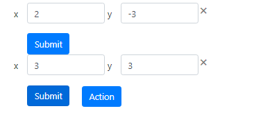

#Todo List
>"_this project is used for creating a list of Field_"...
 *Action is used for Adding a List of the Input Field
 *close icon is used for the deleting the field
 *submit is used to store the input Field 
### `npm start`
Runs the app in the development mode. 
Open [http://localhost:3000](http://localhost:3000) to view it in the browser.

The page will reload if you make edits. 
You will also see any lint errors in the console.
 
 ###picture of the input Field
 